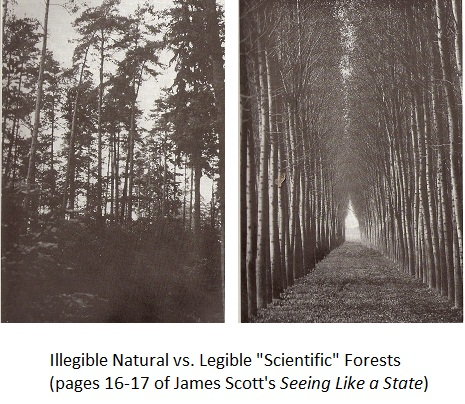
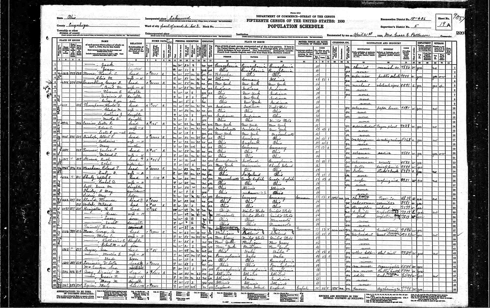

# 2. Literacy and power

Throughout history, forms of social organization were always tightly related to the ways in which information was produced, distributed and consumed. The freedom and agency of individuals and groups was structured by conditions of access to and control over information. Under feudalism, the power to author these conditions was monopolized by the clergy of the Christian Church. Their power over an illiterate society was sprung from their capacity to frame conditions of existence through religious dogmas. Johannes Gutenberg's invention of the printing press in the 15th century had unleashed a historical process that brought with it revolutions in political and scientific thinking and eventually, a radically different social order.

Until the invention of printing, knowledge could only be reproduced through the expensive and time-consuming way of copying manuscripts by hand. Book production was the monopoly of the Catholic Church which exercised total control over the types of information that could be circulated. Furthermore, literacy was the privilege of an elite and the Church's monopoly over information secured their power over the illiterate majority. Members of the clergy were the only ones that possessed the necessary means of framing reality and producing dominant ways of thinking. Possessing the power of literacy, they were the authors of the laws that structured people's daily experience.

The invention of printing technology had far reaching implications. By enabling the fast and cheap reproduction of information, alternative political views could now be effectively disseminated. Print provided the ground for the practice of public discourse and the distribution of knowledge. This slowly lead to the increase of literacy which empowered a growing number of people to question the dogmas of the Christian Church. The fast and cheap reproduction technique of printing meant that authorship over frames of reality and structures of experience was not anymore the monopoly of the clergy. Over the course of centuries, the free flow of information eroded the power of the Church giving way to the Protestant Reformation, the Renaissance the rise of market economies, the Enlightenment, the scientific and industrial revolution and the rise of nation states.

<!--  -->

How could a technical innovation induce such a far reaching process of social change? Did it create this change or did it facilitate latent social forces? According to Marshall McLuhan *"[...]with the Gutenberg technology we move into the age of the take-off of the machine. The principle of segmentation of actions and functions and roles became systematically applicable wherever desired"* [@gutenberggalaxymaking_mcluhan_2011, 276]

Printing technology's importance did not only lie in its enabling the distribution of knowledge, it was also a protocol of segmentation and modularization, the same protocol that gave rise to the Industrial Society. [@industrialsociety_2016] The main thesis of McLuhan is that new technologies create new ways of framing and perceiving - a new forms of legibility - of the world, which in turn instantiate new forms of social organization. This is what McLuhan meant by the often quoted slogan "The Medium is the Message". The distribution of powers, the specialization of knowledge, the division of labor were all instances of a consciousness that the technology of printing facilitated, or in McLuhan's words: *"Print exists by virtue of the static separation of functions and fosters a mentality that gradually resists any but a separative and compartmentalizing or specialist outlook"* [@gutenberggalaxymaking_mcluhan_2011, 126]

<!--  -->

Do technological innovations inevitably create new forms of societies? McLuhan is considered to be a theorist of 'technological determinism'.[@technologicaldeterminism_2015] The basic assumption of this theory is that technological progress is the main driving force of the development of societies. Social determinism on the other hand inverts this relationship and posits that societies are the autonomous forces that shape technology. Both are reductionist theories that try to explain the complex relationships between technology and society in terms of a simple cause-end-effect mechanism.

A resolution of conflict between the two opposing views may be found in a synthesis of these theories. The way I see it, it is both counterproductive to see technological change as a force producing inevitable social change, but also to underestimate its potential to reconfigure society. Technologies do not exist separately from their applications. These applications are in turn determined by social forces. However, technologies facilitate certain kinds of social forces, while they repress others. The relationship between society and technology is characterized by feedback loops rather then determinism; technological and social progress are driven by the synergetic effects of both.

Between the mid-18th and mid-19th centuries Great Britain built a vast network of roads within its territory. The work entailed the development of standards and surveying methods through which land could be rendered accessible and legible. The ideals attached to the state's endeavor were akin to the ones that we see today in the self-proclaimed mission of technology companies such as Apple of Facebook: empowering communities to participate by providing them with an infrastructure to connect. The state's vision was to unite England with Scotland and Ireland under one nation and to stimulate trade and economic growth. However, the project of unification produced side-effects of exclusion. One instance of this is that lower-class travelers who could not afford the convenience of owning a carriage wagon became more segregated. Whereas before, the only means of mobility for both the members of middle and lower classes was to travel by foot, advances in transport allowed the more wealthy to seclude themselves in their stagecoaches. Whereas before, everybody had found their ways by asking directions from fellow travelers, some could now just use the ever more detailed maps produced with increasingly sophisticated surveying methods.

> Middle-class persons in a stagecoach, moving from inn to inn, equipped with pocket watches and shepherded by maps and guidebooks, had fewer practical reasons to interact with strangers. Interactions between rich and poor were reoriented around privileges of access to transport developments. Those who could afford to make use of new transportation did; those who could not afford it continued to get around as they had for generations — on foot. Privileges once enjoyed by the upper classes became the norm for middle-class travel. Isolation had the effect of stigmatizing foot travelers, now visibly marked as the wandering poor. Prejudices arose against mobile communities of journeymen.[@roadspowerbritain_guldi_2012]

The network of roads came to be an instrument of power through their use to render the territory of rebels legible and therefore controllable to the British state. These rebels were the Jabobists, members of a political movement that aimed to restore the Catholic Stuart King James II of England and his heirs to the thrones of England, Scotland and Ireland.[@jacobitism_2016]. According to Guldi more than nine hundred miles of military roads were built connected by one thousand bridges that enabled British troops to keep the areas of Jacobists under surveillance.

> It was hoped that [roads] would also increase industry in the areas through which they passed, but this was a secondary concern; they led straight to the glens where rebel lords dominated, passing few centers of population or industry. They were funded from the same taxes that fueled other military expenditure, and they formed a major laboratory for the invention of new siting, surveying, and paving technologies in difficult territory.

<!--  -->

Power thus, is predicated upon the capacity of rendering the world legible. In the case of 18th-19th century Britain, this capacity manifested as the development of road networks and surveying methods to see and to rule over territories. In the case of the medieval church, it was achieved through maintaining control over the circulation of information, so that the only way to read the world was through the frame of religion. Rendering the world legible is always a process of reduction, of cultural framing.

<!--  -->

In the following chapter, I will take a closer look at this issue from the perspective of graphic design and what this means in terms of social agency and the role of authorship within our discipline.
